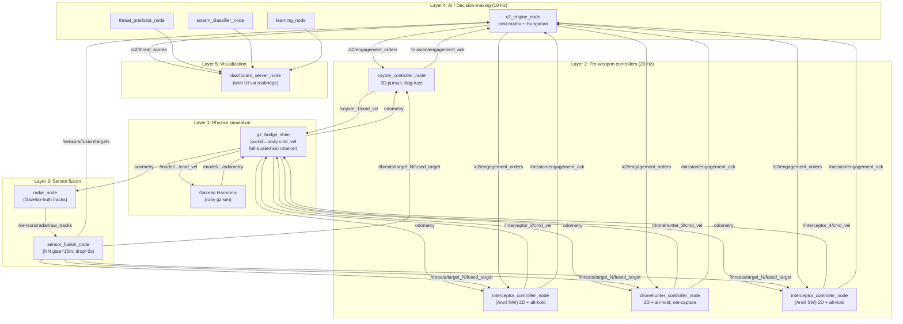
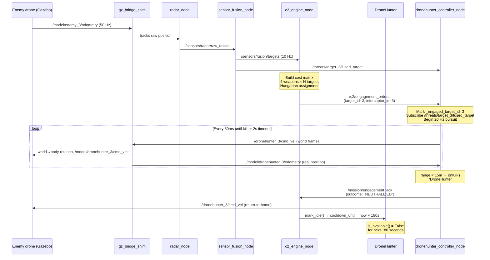

# ACSDG — Technical System Overview

> **Anti-Counter-Swarm Drone Defense Gazebo** — a ROS 2 Humble + Gazebo Harmonic simulation showcasing AI-orchestrated heterogeneous air defense against drone swarms. Graduation project, ~2026-05.

**State at writing:** Phases 1, 2, 3 + Phase 3 prep complete; live demo: 4 NEUTRALISED / 0 BREACHED with three weapon classes engaging simultaneously.

---

## 1. What the system does, end-to-end

A wave of 4 enemy drones spawns at a 280 m perimeter and flies inbound toward a defended base at the origin. Four launcher posts at the corners of a `±177 m` square host a heterogeneous interceptor fleet:

| Slot | Post | Weapon class | Real-world model | Role |
|---|---|---|---|---|
| 1 | NE (+177, +177) | `Coyote` | Raytheon Coyote Block 2 | Long-range frag-fuze jet (160 m/s, 5 km) |
| 2 | NW (−177, +177) | `Anvil` | Anduril Anvil | Close-range kinetic ramming quadcopter (15 m/s, 1.5 km) |
| 3 | SE (+177, −177) | `DroneHunter` | Fortem DroneHunter F700 | Mid-range net-capture octocopter (31 m/s, 2 km, 180 s reload) |
| 4 | SW (−177, −177) | `Anvil` | Anduril Anvil | Close-range kinetic ramming quadcopter |

The AI layer (C2 engine) observes fused sensor tracks at 10 Hz, builds a cost matrix of `time_to_intercept` × `weapon_envelope_validity` for every (weapon, target) pair, runs the **Hungarian assignment algorithm** to optimally pair weapons with targets, and dispatches engagement orders. Per-weapon C++ flight controllers execute the engagements.

Live demo confirms 4/4 kills with weapon-class differentiation visible in the kill-log tags: `[FRAG-FUZE p50]` (Coyote), `[NET-CAPTURE]` (DroneHunter), and plain `NEUTRALISED` (Anvils).

---

## 2. Architecture — the five layers



### Layer 1 — Physics

**Gazebo Harmonic** runs as a single ruby `gz sim` process. World file `military_base.sdf` defines the 5 km × 5 km flat plane with `<gravity>0 0 0</gravity>` (drones are kinematic velocity-controlled bodies — gravity off lets the velocity-control plugin hold altitude between command ticks). Each drone is an SDF model with two plugins:
- `gz-sim-velocity-control-system` — applies `cmd_vel` directly as `LinearVelocityCmd` in **body frame**
- `gz-sim-odometry-publisher-system` — emits `/model/<name>/odometry` at 50 Hz with `<dimensions>3</dimensions>` (default is 2D — would silently drop z, breaks altitude logic downstream)

**`gz_bridge_shim`** is a custom Python process that bridges between ROS 2 Humble (Fortress-era `ign.msgs` types) and Gazebo Harmonic (`gz.msgs`). The stock `ros_gz_bridge` shipped with Humble silently drops messages between the two namespaces because of type-string mismatch. The shim uses `gz.transport13` + `gz.msgs10` Python bindings directly.

**Critical detail:** the velocity-control plugin treats `cmd_vel` as body-frame, but every controller publishes in **world frame**. The shim applies the full inverse-quaternion rotation `R(q)^T · v_world` using each body's cached orientation from odometry — yaw-only extraction was tried and rejected because numerical noise puts non-zero roll/pitch on the bodies.

### Layer 2 — Per-weapon flight controllers

Each weapon has a per-instance C++ controller running at 20 Hz. After Phase 3 prep, all four controllers inherit from the same `WeaponControllerBase` (~280 lines of shared logic: topic plumbing, watchdog, return-to-home, kill-radius gate, 20 Hz timer). Each concrete subclass is ~80 lines and overrides two virtuals:

```cpp
virtual void computePursuitCmd(double & vx, double & vy, double & vz) = 0;
virtual std::string onKill(double range_m) = 0;
```

| Subclass | Pursuit math | Kill semantics |
|---|---|---|
| `AnvilControllerNode` | 2D lead pursuit + altitude-hold P-loop at z=50m | Binary "NEUTRALIZED" at <8m collision radius |
| `CoyoteControllerNode` | 3D proportional pursuit toward predicted lead-point (no alt-hold — Mach 0.45 closes engagements in 5–10 s, too short for tgt_vz noise to diverge) | Two-band frag-fuze: guaranteed kill <5m `[FRAG-FUZE p50]`; probabilistic kill 5–8m `[FRAG-FUZE p30]` (60% Pkill against SMALL_QUAD) or `[FRAG-FUZE MISS]` (returns "MISS") |
| `DroneHunterControllerNode` | 2D + alt-hold (Anvil pattern; 31 m/s pursuit needs alt-hold to be robust against tgt_vz noise over ~30 s engagements) | Binary "NEUTRALIZED" at <15m net-deploy range, log tag `[NET-CAPTURE]` |

Per-target subscriptions are dynamic — when an EngagementOrder arrives, the controller resets its current `target_sub_` and creates a new one for `/threats/target_<N>/fused_target`. A 2-second watchdog (40 ticks at 20 Hz) publishes a "LOST" ack and returns home if the target track stops updating.

### Layer 3 — Sensor fusion

**`radar_node`** runs in `use_gazebo_truth=true` mode (default). It reads `/model/enemy_<N>/odometry` directly from the bridge and publishes synthetic `RadarTrack` messages — no actual radar sim. The historical alternative was `rf_node`, which ran a hardcoded spiral trajectory and combined with Gazebo-truth produced ghost tracks that looked real to fusion; it's now disabled in the launch.

**`sensor_fusion_node`** uses **nearest-neighbor data association** with a 15 m gate radius and a 2-second drop timeout. Tracks are published in two forms:
- `/sensors/fusion/targets` (JSON in `std_msgs/String`) — array of all current tracks for C2's threat-scoring loop
- `/threats/target_<N>/fused_target` (per-target topic, `acsdg_msgs/FusedTarget`) — for individual controllers to subscribe to

### Layer 4 — AI / Decision-making

**`c2_engine_node`** is the brain. At 10 Hz:

1. Build `Track` objects from the fusion JSON, scoring each via `score_threat(track)` (a closed-form heuristic combining proximity-to-base, inbound velocity component, altitude band).
2. Filter to the unassigned subset (those with no weapon currently engaging them) and the available subset (weapons with `is_available() == True`).
3. Build a cost matrix `cost[i, j]` for every (idle weapon i, unassigned target j) pair via `time_to_intercept(weapon, track)`. Weapons outside their `engagement_envelope` get `+inf`.
4. Solve via the **Hungarian algorithm** (pure-Python implementation in `assignment/solver.py`) to minimize total ToI.
5. For each assignment, the `Dispatcher.translate(weapon, track)` builds an `EngagementOrder` payload and the engine publishes it on `/c2/engagement_orders`.

Weapons compose into the engine via the Phase 3 prep `FLEET` module — single source of truth for which weapon class occupies which slot:

```python
FLEET: tuple[Slot, ...] = (
    Slot(1, Coyote,      "coyote_0",      "coyote_controller_node",       "coyote",       1, ( 177.0,  177.0, 20.0)),
    Slot(2, Anvil,       "anvil_1",       "interceptor_controller_node",  "interceptor",  2, (-177.0,  177.0, 20.0)),
    Slot(3, DroneHunter, "dronehunter_0", "dronehunter_controller_node",  "dronehunter",  3, ( 177.0, -177.0, 20.0)),
    Slot(4, Anvil,       "anvil_3",       "interceptor_controller_node",  "interceptor",  4, (-177.0, -177.0, 20.0)),
)
```

This tuple is consumed by the C2 engine, the gz bridge, the launch file, and the world SDF agreement check — eliminating the four-file hand-synchronization that bit Phase 2.

**`threat_predictor_node`** and **`swarm_classifier_node`** are AI layers that publish on `/ai/threat_predictions` and `/ai/swarm_classification` for visualization. The classifier currently returns `SMALL_QUAD` for all targets (Phase-1 stub); Phase 4 will wire the full Bayesian classifier with class-conditional sensor signatures.

**`learning_node`** is a placeholder for the Phase 5 reinforcement-learning layer that will adapt the cost-function weights over time.

### Layer 5 — Visualization

A web dashboard reads ROS topics via **rosbridge_websocket** (port 9090). The `dashboard_server_node` serves the static frontend. Metrics shown: per-weapon state (IDLE/PURSUING/RETURNING/cooldown), live track positions, threat scores, engagement events, mission KPIs.

---

## 3. The 18-process tree

A single `ros2 launch acsdg_full.launch.py` brings up:

| # | Process | Layer | Role |
|---|---|---|---|
| 1 | `gz` (ruby) | 1 | Gazebo Harmonic simulator |
| 2 | `parameter_bridge` | 1 | ros_gz_bridge for `/clock` only |
| 3 | `gz_bridge_shim` | 1 | Custom cmd_vel + odometry bridge (Python) |
| 4 | `enemy_driver_node` | 1 | Drives enemy drones on wave_trigger; despawns on kill ack |
| 5 | `radar_node` | 3 | Reads gazebo-truth, publishes RadarTrack |
| 6 | `sensor_fusion_node` | 3 | NN gate + drop, publishes fused targets |
| 7 | `c2_engine_node` | 4 | Threat scoring + Hungarian assignment + EngagementOrder issue |
| 8 | `interceptor_manager_node` | 4 | Per-slot IDLE/PURSUING/RETURNING state machine + dashboard data |
| 9 | `mission_manager_node` | 4 | Wave logic, difficulty, KPIs |
| 10 | `coyote_controller_node` | 2 | Coyote flight controller (3D pursuit + frag-fuze) |
| 11 | `interceptor_controller_node` (Anvil 2) | 2 | NW Anvil flight controller |
| 12 | `dronehunter_controller_node` | 2 | DroneHunter flight controller (2D + net-capture) |
| 13 | `interceptor_controller_node` (Anvil 4) | 2 | SW Anvil flight controller |
| 14 | `threat_predictor_node` | 4 | AI threat prediction (Phase 5 placeholder) |
| 15 | `swarm_classifier_node` | 4 | AI swarm classifier (Phase 4 stub) |
| 16 | `learning_node` | 4 | RL learning (Phase 5 placeholder) |
| 17 | `rosbridge_websocket` | 5 | WebSocket bridge for dashboard |
| 18 | `dashboard_server_node` | 5 | Web UI server |

---

## 4. The 39-topic graph

Topics split into 5 functional groups:

### 4.1 — Command/control bus (the AI's nervous system)

```
/sensors/fusion/targets          std_msgs/String           (JSON array of tracks)
/c2/threat_scores                std_msgs/String           (JSON array of {id, score, state})
/c2/engagement_orders            acsdg_msgs/EngagementOrder
/mission/engagement_ack          std_msgs/String           (JSON {target_id, interceptor_id, outcome})
/mission/wave_trigger            std_msgs/Bool
/mission/wave_status             std_msgs/String
/mission/status                  acsdg_msgs/MissionStatus
/mission/difficulty              std_msgs/Float32
```

### 4.2 — Per-target track topics (controller subscribes dynamically)

```
/threats/target_1/fused_target   acsdg_msgs/FusedTarget
/threats/target_2/fused_target   acsdg_msgs/FusedTarget
/threats/target_3/fused_target   acsdg_msgs/FusedTarget
/threats/target_4/fused_target   acsdg_msgs/FusedTarget
```

### 4.3 — Per-weapon state + position topics

```
/interceptors/unit_<id>/position   geometry_msgs/Point        (id ∈ {1, 2, 3, 4})
/interceptors/unit_<id>/state      acsdg_msgs/InterceptorState
/interceptors/fleet_status         std_msgs/String            (JSON aggregate for dashboard)
```

### 4.4 — Velocity bus (controller → bridge → Gazebo)

```
/coyote_1/cmd_vel        geometry_msgs/Twist  →  /model/coyote_1/cmd_vel (gz)
/interceptor_2/cmd_vel   geometry_msgs/Twist  →  /model/interceptor_2/cmd_vel (gz)
/dronehunter_3/cmd_vel   geometry_msgs/Twist  →  /model/dronehunter_3/cmd_vel (gz)
/interceptor_4/cmd_vel   geometry_msgs/Twist  →  /model/interceptor_4/cmd_vel (gz)
```

Reverse direction (Gazebo → bridge → controllers):
```
/model/<kind>_<id>/odometry      nav_msgs/Odometry
```

### 4.5 — Sensor + AI auxiliary topics

```
/sensors/radar/raw_tracks        acsdg_msgs/RadarTrack
/ai/threat_predictions           acsdg_msgs/ThreatPrediction
/ai/swarm_classification         acsdg_msgs/SwarmClassification
/learning/status                 std_msgs/String
```

---

## 5. The engagement loop in 6 steps

A single target lifecycle, taking ~3-15 seconds depending on weapon class:



---

## 6. The cost matrix — how the AI decides

`build_cost_matrix(idle_weapons, unassigned_targets)` produces a 2D float matrix where `cost[i,j]` = `time_to_intercept(weapon_i, target_j)`, or `+inf` if `weapon_i.engagement_envelope()` excludes `target_j`'s position.

Each weapon's `time_to_intercept` accounts for the closing rate:

```python
v_proj = -(unit_range_to_target · target_velocity)   # +ve if closing
eff_speed = self._clamp_eff_speed(max_speed, v_proj)  # min 0.5 * max_speed
return range_m / eff_speed
```

The clamp at `0.5 * max_speed` is a Phase-3-prep fix (closes review item N-C): without it, a stern-aspect SHAHED at 185 m/s vs Coyote at 160 m/s gave `eff_speed = max(1.0, -25) = 1.0` and ToI in seconds collapsed to a meaningless `range / 1.0`.

The Hungarian algorithm (Kuhn-Munkres) finds the assignment minimizing the sum of selected costs in O(n³). For a 4×4 matrix this is sub-millisecond. Output is a list of `(weapon_idx, target_idx)` pairs that get translated into EngagementOrders.

**Today's cost function is ToI-only.** Phase 5 will swap to expected-utility:

```
cost(w, t) = -log(P_kill(w | class(t))) + α · ToI(w, t) + β · resource_cost(w)
```

This makes Pkill (per-class probability of kill) trade off against speed and consumable cost — turning "fastest weapon wins" into real heterogeneous-fleet decision-making.

---

## 7. Multi-shot semantics — DroneHunter's 180 s cooldown

Unique to Phase 3. After a successful capture, DroneHunter must refuse re-dispatch for 180 s (the spec's `relaunch_time`, modeling net-magazine reload). Implementation lives entirely in Python — no controller-side or message-schema changes:

```python
class DroneHunter(WeaponSystem):
    def is_available(self) -> bool:
        if self._engaged_target_id is not None:
            return False
        return time.time() >= self._cooldown_until

    def mark_idle(self) -> None:
        was_engaged = self._engaged_target_id is not None
        self._engaged_target_id = None
        if was_engaged:
            self._cooldown_until = time.time() + 180.0
```

The `was_engaged` guard is critical: `mark_idle()` is invoked every IDLE tick at 10 Hz from the InterceptorState bus. Without the guard the cooldown would reset every 100 ms and never expire.

The C2 engine's `_on_timer` loop excludes any weapon where `is_available() == False` from the cost matrix, so a cooled-down DroneHunter is invisible to the dispatcher until 180 s elapse — even though its physical body is idle at home.

---

## 8. Phase rollout — what's done, what's next

Per the original 5-phase rollout (`docs/superpowers/specs/2026-05-02-ai-orchestrated-heterogeneous-defense-design.md`):

| Phase | Status | Delivers |
|---|---|---|
| 1 | ✅ Done | Modular C2 (WeaponSystem ABC, classifier stub, cost-function module, dispatcher), Anvil class, full-quaternion bridge fix |
| 2 | ✅ Done | Coyote Block 2 (frag-jet) + supporting world spawn + bridge wiring + integration tests |
| 3 prep | ✅ Done | FLEET single source of truth, WeaponControllerBase abstract C++ class, probabilistic frag-fuze, ToI clamp, dispatcher FLEET-driven, gz_instance_index validator |
| 3 | ✅ Done | DroneHunter F700 (net-capture octocopter) + 180 s multi-shot cooldown |
| 4 | ⏳ Next | Skyranger 30 (gun turret) + Bayesian classifier hookup (real per-class Pkill instead of always-SMALL_QUAD) |
| 5 | ⏳ Future | Expected-utility cost function + RL adaptation + showcase demo polish |

After Phase 3, the architecture is "append one Slot to FLEET, write one C++ subclass" for new weapons — the Skyranger 30 will land as ~7 files, no architectural changes required (modulo the gun turret's ballistic-ToF semantics, which may need a `computeFireSolution` virtual sibling to `computePursuitCmd`).

---

## 9. Build, run, test

```bash
# Build (acsdg_c2 needs C++ rebuild on each change; everything else symlinks)
source /opt/ros/humble/setup.bash
cd ~/acsdg_ws
colcon build --symlink-install

# Run
source install/setup.bash
LIBGL_ALWAYS_SOFTWARE=1 ros2 launch acsdg_bringup acsdg_full.launch.py headless:=false

# Trigger waves (5 publishes at 0.5 Hz to defeat DDS discovery race)
ros2 topic pub --times 5 -r 0.5 /mission/wave_trigger std_msgs/Bool '{data: true}'

# Test (91 tests; ~3 documented flaky integration tests in WSL DDS environment)
python3 -m pytest src/acsdg_c2/test/ -v
```

Test breakdown:
- **40 unit tests** for weapon classes (envelope, Pkill, ToI, cooldown semantics)
- **13 FLEET tests** (uniqueness validators, SDF agreement, gz_instance_index assertion)
- **6 dispatcher tests** (FLEET-driven routing, error paths)
- **6 cost-function / threat-priority tests**
- **2 launch dry-run tests** (one Node per FLEET slot, home params propagate)
- **4 integration tests** (in-process rclpy harness — Coyote and DroneHunter dispatch paths)
- **20+ supporting tests** (sensor-fusion, classifier stub, mission-manager KPIs)

---

## 10. Repository

[github.com/monyhm/ACSDG](https://github.com/monyhm/ACSDG) — branch `main`. ~85 commits across Phases 1-3.

Key directory structure:

```
acsdg_ws/
├── docs/superpowers/
│   ├── specs/      # design specifications per phase
│   └── plans/      # TDD implementation plans per phase
├── src/
│   ├── acsdg_msgs/         # custom ROS messages (EngagementOrder, FusedTarget, etc.)
│   ├── acsdg_sensors/      # radar + fusion (C++)
│   ├── acsdg_c2/           # C2 brain + per-weapon Python classes + C++ controllers
│   │   ├── acsdg_c2/       # Python: fleet, weapons, classifier, dispatcher, cost_function
│   │   ├── src/            # C++: weapon_controller_base + per-weapon controllers
│   │   ├── include/        # C++: weapon_controller_base.hpp
│   │   ├── launch/         # c2.launch.py (FLEET-driven)
│   │   └── test/           # 91 tests (unit + integration + launch dry-run)
│   ├── acsdg_gazebo/       # SDF models, world, gz_bridge_shim
│   ├── acsdg_ai/           # threat predictor, swarm classifier, learning
│   ├── acsdg_bringup/      # full-stack launch composition
│   └── acsdg_dashboard/    # web UI + dashboard_server_node
└── HANDOFF.md              # session-to-session continuity doc
```
